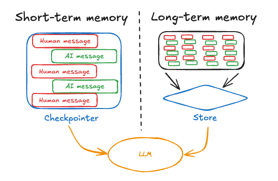

# langchain

官方tutorials：https://python.langchain.com/docs/tutorials/

## Tool

## Memory
https://langchain-ai.github.io/langgraph/concepts/memory/

### state (short-term memory)

#### 管理对话历史

key notes：
1. 对话历史应该遵循以下结构：
    * The first message is either a "user" message or a "system" message, followed by a "user" message and then an "assistant" message.
    * The last message should be either "user" message or a "tool" message containing ther result of a tool call.
    * "tool" message should only follow an "assistant" message that requested the tool invocation.

### stores (long-term memory)

## Chain

### Simple Sequential Chain

### Sequential Chain

### Router Chain
